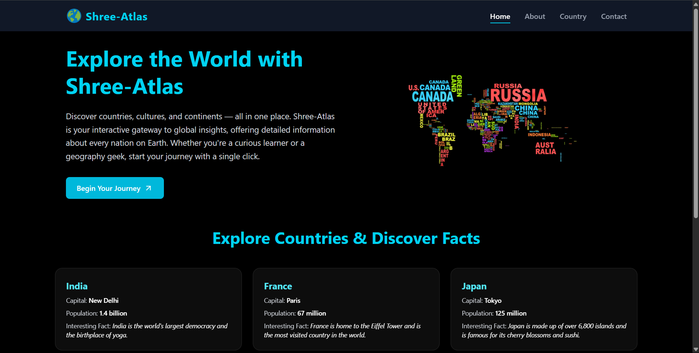
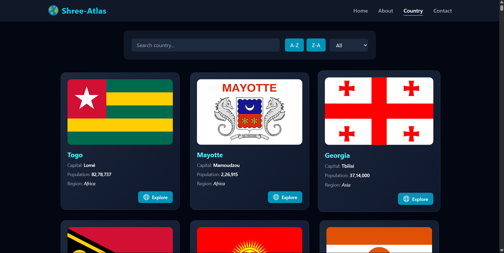
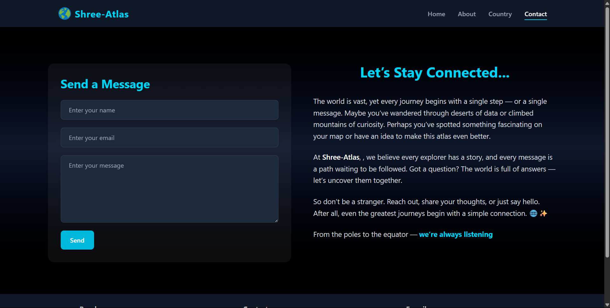

# 🌍 Shree‑Atlas

Interactive world atlas built with React, Tailwind CSS, and framer-motion—featuring global country facts, maps, and seamless navigation.

## 🚀 Live Demo

Explore the live version of the project here:  
🔗 [Shree Atlas – Country Explorer](https://shree-atlas.netlify.app/country)

---


## 📷 Screenshots

### 🏠 Home Page


---

### 🌍 Country List Page


---

### 💬 Contact Page


---

## 🛠️ Tech Stack

- **Frontend**: React, React Router, Tailwind CSS
- **Animations**: framer-motion
- **Icons**: react-icons
- **Data**: REST API for country data (likely `restcountries.com`), plus a local JSON facts file (`apiData.json`)
- **State Management**: React Hooks (`useState`, `useEffect`, `useTransition`)

---

## 📁 Project Structure

src/
├─ api/ # Static data (e.g. apiData.json, optional footer data)
├─ components/
│ ├─ ui/
│ │ ├─ Card.jsx # Country cards (Homepage & About)
│ │ ├─ Details.jsx # Country list view
│ │ ├─ SearchFilter.jsx # Country filter/search UI
│ │ ├─ HeroSection.jsx # Homepage hero
│ │ ├─ Header.jsx # Navigation bar
│ │ ├─ Footer.jsx # Footer with contact info and nav
├─ pages/
│ ├─ Home.jsx
│ ├─ About.jsx
│ ├─ Country.jsx # Main country search/list page
│ ├─ Contact.jsx
│ ├─ [CountryDetail].jsx # Optional: individual country detail page
├─ App.jsx
├─ main.jsx # Vite entry
├─ vite.config.js
└─ index.css

---

## 🎯 Key Features

- **Homepage** with animated hero section and sample country cards
- **About page** with smooth animations and global facts
- **Country page** featuring live data fetched from API, plus sorting, filtering, search, and animated cards
- **Contact page** with styled form and motion-enhanced storytelling
- **Responsive header** with a globe icon and mobile-friendly menu
- **Dynamic footer** displaying contact links and navigation

---

## 💻 Getting Started

### Prerequisites
```bash
node -v >= 16
npm -v >= 8

Installation & Run Dev Server

git clone https://github.com/Dreamergopal/world-atlas.git
cd world-atlas
npm install
npm run dev

```

📞 Contributions

Built by Dreamergopal

Contributions are welcome! Please open an issue or submit a pull request.

---

📬 Connect with Me

<p align="left"> <a href="https://www.linkedin.com/in/dreamergopal" target="_blank">  </a> <a href="https://github.com/Dreamergopal" target="_blank">  </a> </p>


